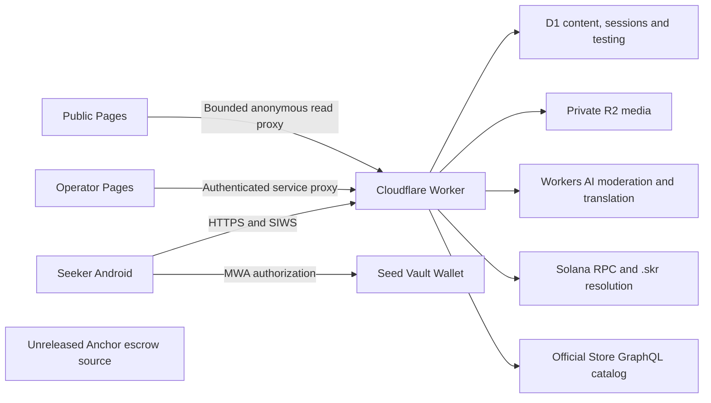

# Architecture

Updated 6 October 2026. Native Kotlin/Compose Android; no Expo or web app wrapper.

## Boundaries

`apps/mobile/app` owns the UI, local preferences/session storage, media preparation and MWA. `apps/api` owns authorization, moderation, D1/R2 and lifecycle rules. `apps/admin` is the operator UI and service-binding proxy. `apps/site` is a bilingual product/legal site with a read-only status/catalog proxy. `programs/testing-escrow` is separate unreleased chain code, not a dependency of the online campaign API.

The Android client and Pages clients are untrusted. Worker authorization is enforced on every action. The site accepts only fixed anonymous GET endpoints, never forwards user cookies/Authorization or arbitrary URLs, caps catalog results at 12, and renders external metadata as text. Admin mutations require a valid password session plus allowed Origin and the custom anti-CSRF header, or a verified Access owner assertion. Access setup/recovery uses a separate protected hostname.

## Identity and data

- SIWS verifies a five-minute single-use challenge, exact signed message and Ed25519 signature. Mainnet .skr reverse/forward ownership checks establish wallet/domain control, not real identity or developer affiliation.
- D1 stores only hashed bearer sessions. Wallet authorization is not transaction authorization.
- `needs` supports community questions, feedback and linked campaign posts. `kind=feedback` and `store_package` identify app-specific feedback; edited posts retain revisions. Comments are immutable but deletable.
- Private app/question follows are distinct from campaign reservations. Conversations are participant-only, server-stored and not end-to-end encrypted.
- `testing_campaigns`, `testing_entries`, `testing_events` record immutable published criteria, exact-unit pools, participant states, reviews, appeals and audit. Migration 0020 adds revision guards for private unfunded edits.
- Campaign admission is a single capacity-checked SQLite insertion. Submitted, approved and disputed results remain held. Revision-guarded transitions generate audit/notification only when successful.
- Public campaigns hide blocked hosts; already enrolled testers retain obligation access. Unresolved testing obligations restrict account deletion. Moderator removal stops recruitment without erasing participation.
- R2 holds sanitized WebP media. Official `store_catalog` contains bounded imported metadata and no APK files. Catalog/translation jobs keep previous data on source failure and enforce AI budgets.

## Lifecycle

Free invitation → open → reserve → submit → review/correct/appeal → complete. Positive rewards create a private unfunded draft. Simulation funding, settlement and refund require `BOUNTY_MODE=simulation`, `ENVIRONMENT=devnet`, `PAYMENT_MODE=simulation` simultaneously; the public deployment uses `BOUNTY_MODE=disabled`.

The proposed chain program enforces deposit/vault and fixed token recipients, but is not deployed. Before paid launch, chain state must be authoritative for reservations, report hashes, decisions, reward+fee settlement and refunds. D1 must reconcile confirmed transactions, not independently pretend to settle real funds. The compiled SBF artifact now passes 13 isolated account/CPI cases; [validation evidence](escrow-validation-2026-10-06.md) defines their limits. Live wallet construction/confirmation, deployment and reconciliation remain outstanding.

## Deployment and release

Worker + D1 + R2; two Pages projects (admin/site). Mainnet identity lookup uses a private credentialed RPC; online community configuration remains Devnet. In-app notifications are enabled; FCM delivery is deferred.

A signed APK, physical acceptance, App/Release NFTs and Store review/distribution are separate evidence. See [deployment](deployment.md) and [release checklist](release-checklist.md). Do not treat an old APK's acceptance as proof of a later build or live escrow.
