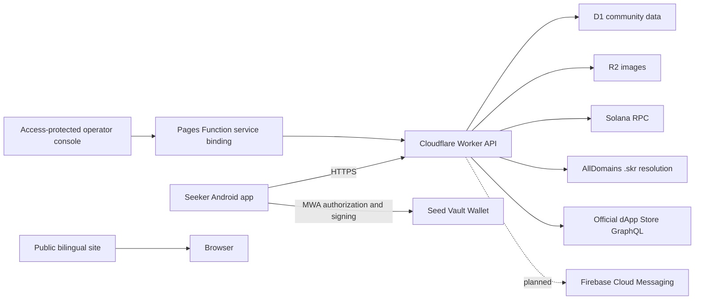
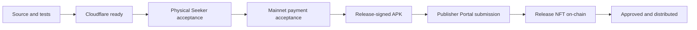

# Architecture

## System boundary

## Repository boundaries

- `apps/mobile/app` owns Android UI, local session storage, MWA, and media preparation.
- `apps/api` owns authentication, authorization, content, moderation, payment
  verification gates, D1, and R2 access.
- `apps/admin` is an operator-only Pages application for review, reports,
  content, identities, promotions, catalog operations, announcements, and audit
  history. It never receives a shared administrator secret in the browser.
- `apps/site` owns the public website and legal/support pages.
- `packages/core` contains portable validation and exact-unit payment rules.
- `tests` exercises API contracts, integer payment rules, and database invariants.
- `docs` contains release decisions, evidence requirements, and operator runbooks.

No component hosts APK files. Community work submissions identify the dApp by
name and do not accept download URLs or Store deep links. Users locate those
apps themselves in the Solana dApp Store.

## Trust boundaries

- The Android app is untrusted input. Authorization is enforced again in the Worker.
- The wallet signs authentication messages and separately approves transactions. The app never accesses Seed Vault keys.
- `.skr` ownership is resolved server-side on Mainnet through a credentialed
  RPC stored as a Cloudflare secret and checked in both directions at login.
- D1 is authoritative for off-chain content and recommendation state. Solana is authoritative for confirmed payment.
- Cloudflare Access is a prerequisite for `/admin/*`; the Worker also verifies the Access JWT audience, issuer, and administrator email.

## Data ownership

- `.skr` is the stable account identifier.
- `wallet_address` is the latest wallet proven to own that `.skr`; it can change after an allowed Seed Vault transfer.
- Posts and comments are immutable. Deletion sets `deleted_at`; background retention jobs remove eligible data later.
- Natural ranking fields and promotion fields are separate.
- `store_catalog` is a separate, read-only discovery index for official Solana
  dApp Store metadata. It is never treated as community UGC or paid promotion.
- `user_blocks` is private per-user preference data. Authenticated feeds, search,
  profiles, details, and comments exclude authors blocked by that viewer.
- `moderation_events` records privacy-minimized enforcement metadata only. It
  never stores rejected text or the phrase that matched.

## Network gates

- Devnet builds use `solana:devnet` and `PAYMENT_MODE=simulation`; `.skr`
  identity resolution still uses a separate credentialed Mainnet RPC.
- Production builds use `solana:mainnet` and `PAYMENT_MODE=onchain` only after physical Seeker acceptance.
- `mainnet_payments_enabled` is a second server-side gate and defaults to false.

## Current implementation notes

- Search uses parameterized matching across need and work text fields. This avoids D1 deployments that disallow FTS virtual-table writes from triggers and works predictably for Chinese text. Revisit a separately maintained search index only after measured scale requires it.
- All public UGC text passes through one Worker-side rules engine before any
  database write. Rules handle explicit community restrictions and Cloudflare Workers AI classifies remaining submitted text. Only a safe result allows the write; model failure returns 503. Operator publication rechecks the text. Public UGC reads apply current deterministic rules to older records without deleting them; reporting and manual image review remain necessary.
- Official catalog search uses the separate `store_catalog` table and is clearly
  labeled as Solana dApp Store content.
- FCM tables and setup documentation are present, but device registration and push delivery remain disabled until Firebase credentials are configured.
- Recommendation confirmation is simulation-only on Devnet. No Mainnet SPL transfer is constructed or accepted by this baseline.
- The four-hour Worker Cron advances a bounded catalog batch; one full refresh
  completes in roughly one day. It imports from the official GraphQL
  directory. Sync uses bounded pagination, detail batches, HTTPS URL validation,
  and soft deactivation; a failed sync leaves the previous catalog intact.

## Release gates

A later gate cannot be treated as complete because an earlier artifact exists.
For example, an uploaded APK is not a live Store release.
